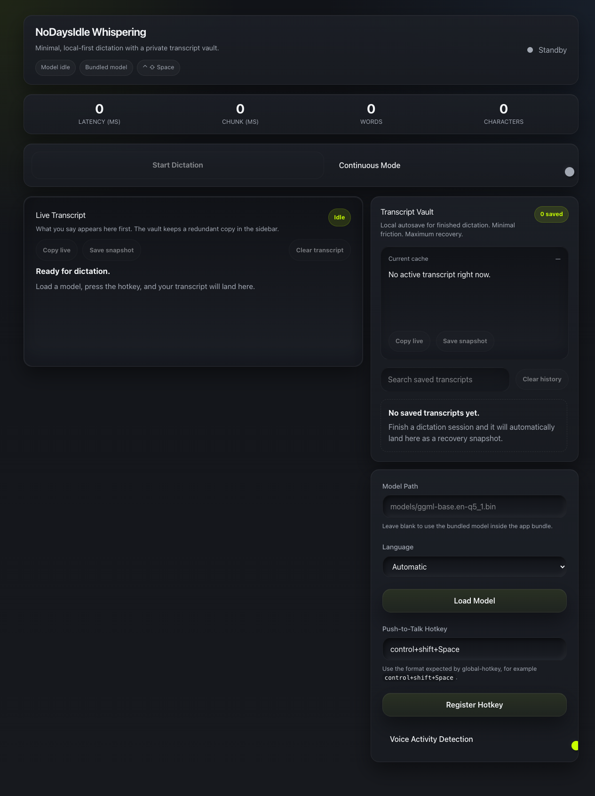

# NoDaysIdle Whispering

> Local-first macOS dictation with a native Tauri shell, Rust audio/transcription backend, and React transcript vault.


<p align="center">
  
</p>

## Overview

NoDaysIdle Whispering is a local-first macOS dictation app built for fast push-to-talk dictation, private local transcription, and a searchable transcript vault. It uses Whisper.cpp for on-device speech recognition, wrapped in a Tauri 2 shell with a React frontend.

No cloud transcription, no telemetry, no account.

## Screenshot

<p align="center">
  
</p>

## Features

- **Local-first transcription** — speech stays on your machine
- **Bundled Whisper model** — package `models/ggml-base.en-q5_1.bin` into the app bundle
- **Global hotkey** — register a push-to-talk shortcut from app settings
- **Transcript vault** — save, search, pin, archive, copy, and clear transcript entries
- **Native text insertion** — supports final paste and backend insertion modes
- **Premium dark UI** — compact macOS utility layout with status chips and live metrics

## Technology

| Layer | Stack |
|-------|-------|
| Shell | Tauri 2 |
| Backend | Rust (whisper-rs + whisper.cpp) |
| Frontend | React + TypeScript + Vite |
| Storage | Local transcript vault |

## Requirements

- macOS 14 or later
- Node.js 20 or later
- Rust via [rustup](https://rustup.rs/)
- Tauri prerequisites for macOS
- Whisper model file at `models/ggml-base.en-q5_1.bin`, or set `WHISPER_MODEL_PATH` to an external path

The model binary is intentionally ignored by git.

## Installation

### Build and install

```bash
npm install
npm run package:mac
```

This verifies assets, builds the release `.app` bundle with Tauri, installs to `/Applications/NoDaysIdle Whispering.app`, and ad-hoc signs the bundle.

Use `INSTALL_DIR` to package into a local directory:

```bash
INSTALL_DIR="$PWD/.ci-install" npm run package:mac
```

Use `ZIP_OUTPUT` to create a distributable zip:

```bash
INSTALL_DIR="$PWD/.ci-install" ZIP_OUTPUT="$PWD/artifacts/NoDaysIdle-Whispering-local.zip" npm run package:mac
```

The raw Tauri bundle output: `src-tauri/target/release/bundle/macos/NoDaysIdle Whispering.app`

## Development

```bash
npm install
npm run tauri dev
```

Verify locally:

```bash
npm run ci:verify
```

Equivalent manual commands:

```bash
npm run build
cargo test --manifest-path src-tauri/Cargo.toml
```

If `cargo` is not on `PATH` after rustup install:

```bash
export PATH="$HOME/.cargo/bin:$PATH"
```

## Configuration

- **Model path** — leave blank to use the bundled model, or set a local file path in Settings
- **Language** — automatic detection or choose a supported language
- **Hotkey** — default is `control+shift+Space`
- **VAD** — toggle voice activity detection
- **Transcript vault** — local dictation scratchpad and history

## macOS Permissions

For global hotkeys, keyboard insertion, and microphone capture:

- Microphone permission
- Accessibility permission
- Input Monitoring permission

Grant permissions in System Settings if recording, hotkeys, or text insertion do not work.

## Project Structure

```
nodaysidle-whispering/
├── src/                   # React + TypeScript frontend
│   ├── components/
│   └── lib/               # local transcript vault helpers
├── src-tauri/             # Rust backend, Tauri config, entitlements, tests
│   └── icons/             # logo and app icon assets
├── models/                # local Whisper model files (git-ignored)
├── scripts/               # local CI and macOS packaging scripts
└── .github/workflows/     # CI verify/package workflow (self-hosted macOS runner)
```

## Troubleshooting

- **Build fails because of a missing model** — put `ggml-base.en-q5_1.bin` in `models/`, or set `WHISPER_MODEL_PATH`
- **`cargo` is not found** — run `export PATH="$HOME/.cargo/bin:$PATH"` then retry
- **Install to `/Applications` fails** — run from an admin-capable account, or use `INSTALL_DIR`
- **Global hotkey does not fire** — grant Accessibility and Input Monitoring permissions
- **Text insertion fails** — grant Accessibility permission

## Release Verification

Before pushing a release:

```bash
npm run build
cargo test --manifest-path src-tauri/Cargo.toml
INSTALL_DIR="$PWD/.ci-install" ZIP_OUTPUT="$PWD/artifacts/NoDaysIdle-Whispering-local.zip" npm run package:mac
```

Expected artifacts:

```text
.ci-install/NoDaysIdle Whispering.app
artifacts/NoDaysIdle-Whispering-local.zip
```

## Status

Active — v0.1.0. Local-first dictation utility. Ad-hoc signed, not notarized.

## Contributing

This repository is not currently accepting external contributions.

## License

Proprietary — NODAYSIDLE. All rights reserved.
